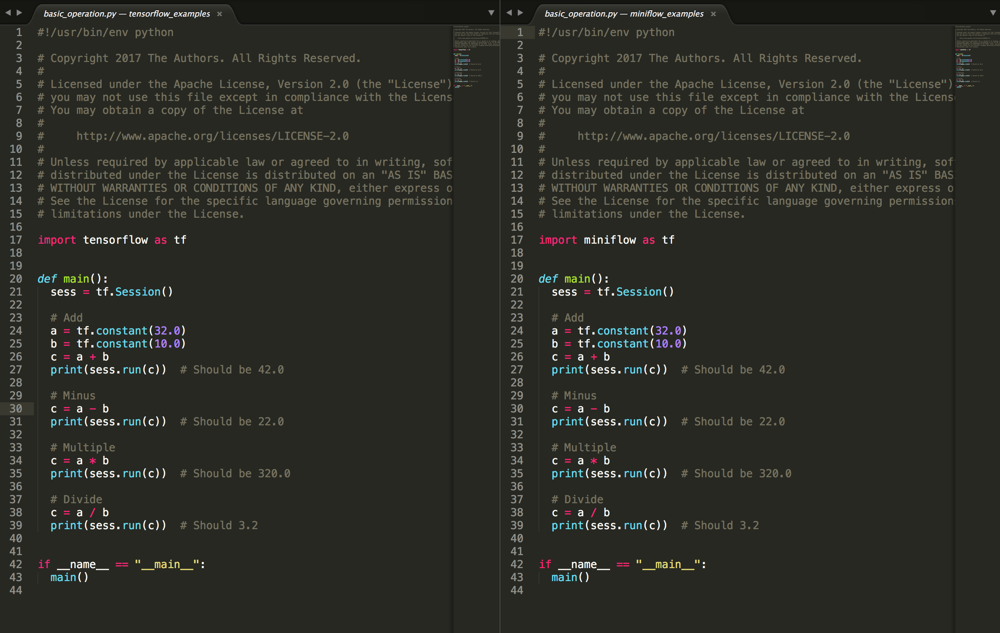
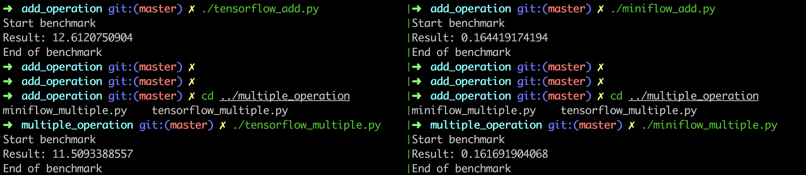

# MiniFlow

## Introduction

MiniFlow is the numerical computation library which implements [TensorFlow](https://github.com/tensorflow/tensorflow) APIs.

* Support autograd for composite operations
* Support operations in C++ backend with swig
* Support lazy evaluation with computation graph
* Support the compatiable APIs with TensorFlow

## Installation

Install with [pip](https://github.com/pypa/pip).

```
pip install miniflow
```

Or run with [docker](https://github.com/moby/moby).

```
docker run -it tobegit3hub/miniflow bash
```

## Usage

MiniFlow has compatiable APIs with TensorFlow and please refer to [examples](./examples) for more usage.



### Basic operations

Run with TensorFlow.

```python
import tensorflow as tf

sess = tf.Session()

hello = tf.constant("Hello, TensorFlow!")
sess.run(hello)
# "Hello, TensorFlow!"

a = tf.constant(10)
b = tf.constant(32)
sess.run(a + b)
# 42
```

Run with MiniFlow.

```python
import miniflow.miniflow as tf

sess = tf.Session()

hello = tf.constant("Hello, MiniFlow!")
sess.run(hello)
# "Hello, MiniFlow!"

a = tf.constant(10)
b = tf.constant(32)
sess.run(a + b)
# 42
```

### Use placeholder

Run with TensorFlow.

```python
import tensorflow as tf

sess = tf.Session()

a = tf.placeholder(tf.float32)
b = tf.constant(32.0)
sess.run(a + b, feed_dict={a: 10})
sess.run(a + b, feed_dict={a.name: 10})
# 42.0
```

Run with MiniFlow.

```python
import miniflow.miniflow as tf

sess = tf.Session()

a = tf.placeholder(tf.float32)
b = tf.constant(32.0)
sess.run(a + b, feed_dict={a: 10})
sess.run(a + b, feed_dict={a.name: 10})
# 42.0
```

### Linear model

Run with TensorFlow.

```python
def linear_regression():
  epoch_number = 30
  learning_rate = 0.01
  train_features = [1.0, 2.0, 3.0, 4.0, 5.0]
  train_labels = [10.0, 20.0, 30.0, 40.0, 50.0]

  weights = tf.Variable(0.0)
  bias = tf.Variable(0.0)
  x = tf.placeholder(tf.float32)
  y = tf.placeholder(tf.float32)

  predict = weights * x + bias
  loss = tf.square(y - predict)
  sgd_optimizer = tf.train.GradientDescentOptimizer(learning_rate)
  train_op = sgd_optimizer.minimize(loss)

  with tf.Session() as sess:
    sess.run(tf.global_variables_initializer())

    for epoch_index in range(epoch_number):
      # Take one sample from train dataset
      sample_number = len(train_features)
      train_feature = train_features[epoch_index % sample_number]
      train_label = train_labels[epoch_index % sample_number]

      # Update model variables and print loss
      sess.run(train_op, feed_dict={x: train_feature, y: train_label})
      loss_value = sess.run(loss, feed_dict={x: 1.0, y: 10.0})
      print("Epoch: {}, loss: {}, weight: {}, bias: {}".format(
          epoch_index, loss_value, sess.run(weights), sess.run(bias)))
```

Run with MiniFlow.

```python
def linear_regression():
  epoch_number = 30
  learning_rate = 0.01
  train_features = [1.0, 2.0, 3.0, 4.0, 5.0]
  train_labels = [10.0, 20.0, 30.0, 40.0, 50.0]

  weights = tf.Variable(0.0)
  bias = tf.Variable(0.0)
  x = tf.placeholder(tf.float32)
  y = tf.placeholder(tf.float32)

  predict = weights * x + bias
  loss = tf.square(y - predict)
  sgd_optimizer = miniflow.optimizer.GradientDescentOptimizer(learning_rate)
  train_op = sgd_optimizer.minimize(loss)

  with tf.Session() as sess:

    for epoch_index in range(epoch_number):
      # Take one sample from train dataset
      sample_number = len(train_features)
      train_feature = train_features[epoch_index % sample_number]
      train_label = train_labels[epoch_index % sample_number]

      # Update model variables and print loss
      sess.run(train_op, feed_dict={x: train_feature, y: train_label})
      loss_value = sess.run(loss, feed_dict={x: 1.0, y: 10.0})
      print("Epoch: {}, loss: {}, weight: {}, bias: {}".format(
          epoch_index, loss_value, sess.run(weights), sess.run(bias)))
```

The computed gradient and the variables of the model are accurate.


## Performance

We have more performance tests in [benchmark](./benchmark/).



## Contribution

GitHub issues and pull-requests are highly appreciated and feel free to make your contribution.

Release to upload the official python package of [miniflow](https://pypi.python.org/pypi/miniflow/) in [pypi](https://pypi.python.org/pypi).

```
python ./setup.py sdist --format=gztar

twine upload dist/miniflow-x.x.x.tar.gz
```
